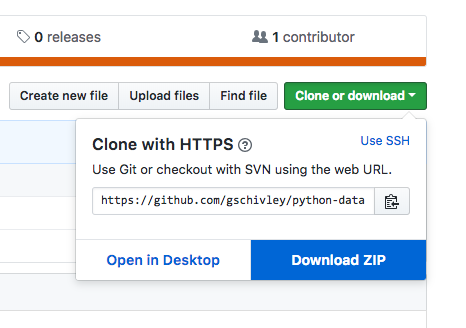

# An introduction to data analysis in Python
The material here is a compilation of concepts, practices, and tools that I've found useful for doing data analysis in Python. Most of it relates to writing code but some is about basic project structure and tools. While Python is a flexible and powerful open-source programming language, data analysis can be difficult to do with only the built-in functions. Many of the tools I'll cover here are packages that provide additional functionality for numeric computation, data import/export, data manipulation, and visualization.

## Getting started
Excel is easy because it only requires double-clicking on a file to open it and start working. We have to do some more work to get started working in Python but it will be worth the extra effort.

### Install Anaconda Python distribution
If you haven't already done so, [download and install the Anaconda distribution of Python 3.6][1]. Anaconda provides a base installation with most packages needed for data analysis and a few extra useful tools. If you don't already have a preferred text editor you can use Spyder, which comes with the Anaconda installation.

#### Conda
We will be using conda, which is a package management system and environment management system that comes with the Anaconda distribution. There are other Python package management systems - like [pip][2] - and you may run across packages that can be installed with pip and not conda. But conda has significant advantages for managing numeric/scientific packages so it will be our primary management system.

In addition to packages, conda also manages isolated environments. Each environment has its own installation of Python and any packages you choose to install. Working in these isolated environments lets you maintain specific package versions for each project. I highly recommend using a new environment for each project you work on.

Useful links:
- [Overview of conda][3]
- [Blog post by Jake VanderPlas][4] on conda, pip, and virtualenv

### Clone or download this repository
We will be using files in this GitHub repository. If you have git installed and know how to use it, simply clone this repository.

`git clone https://github.com/gschivley/python-data-analysis-class.git`

If you don't know how to use git just download and unzip this repository into a directory of your choice.

### Create a conda environment
Each new project should start with a clean environment to ensure that you don't have dependency conflicts. An old project (Project A) might use features from a package that have since been depreciated. Your new Project B might use new features from the same package. Or each might use packages that require different versions of a third package. Create an environment for each package and you don't have to worry about dependency issues.

I've included an `environment.yml` file in this repository. It has everything you need to recreate the environment I used to run the code in this tutorial. Learn more about how to [manage environments here][5].

To make things easy here are instructions for creating an environment from the `environment.yml` file:
- Open terminal or command prompt and navigate to this folder (`python-data-analysis-class`)
- Once you are in the folder, type `conda env create -f environment.yml`
- Conda will install Python, the required packages, and all necessary dependencies
- To [activate the environment][6], type `activate pydata-issst` (Windows) or `conda activate pydata-issst` (Mac or Linux)

## Workshop overview

### Notebooks and basics
I'll start by talking about Jupyter notebooks. They are an awesome way of interactively exploring and manipulating data. After that I'll cover some basics of Python objects. This section will be short and focus on the things that I find most useful in my own work. For a (slightly) longer overview of Python basics geared towards data analysis I recommend [A Whirlwind Tour of Python][7].

####
Jupyter and JupyterLab
Jupyter notebooks are like scientific lab books for code where you can do work interactively and view results as you go. [JupyterLab is the next-generation web-based user interface for Project Jupyter.][12] I have mostly switched over to JupyterLab, but still occasionally use the older style notebooks. The

### Pandas
Next we'll dive into the Pandas library for loading, manipulating, and writing data. Quite often most of the work is making sure that data from external sources is clean and ready analyze. This can involve reformatting column names, checking data types, reshaping data from [wide to tidy-format][8], and generally getting everything ready for the real analysis.

In this workshop we'll load data on electricity [generation][9], [capacity][10], and [environmental emissions][11]. These data are much more useful when combined together, so once they have been loaded we will combine them and output the results to a single csv.

### Visualization
Finally, we'll do some visual exploratory data analysis. Along the way I'll discuss data types, plot types, and how to select color palettes.

[1]: https://www.anaconda.com/download
[2]: https://pypi.org/
[3]: https://conda.io/docs/user-guide/overview.html
[4]: https://jakevdp.github.io/blog/2016/08/25/conda-myths-and-misconceptions/
[5]: https://conda.io/docs/user-guide/tasks/manage-environments.html#managing-environments
[6]: https://conda.io/docs/user-guide/tasks/manage-environments.html#activating-an-environment
[7]: https://nbviewer.jupyter.org/github/jakevdp/WhirlwindTourOfPython/blob/master/Index.ipynb
[8]: http://vita.had.co.nz/papers/tidy-data.html
[9]: https://www.eia.gov/electricity/data/eia923
[10]: https://www.eia.gov/electricity/data/eia860
[11]: https://ampd.epa.gov/ampd/
[12]: https://jupyterlab.readthedocs.io/en/stable/getting_started/overview.html
